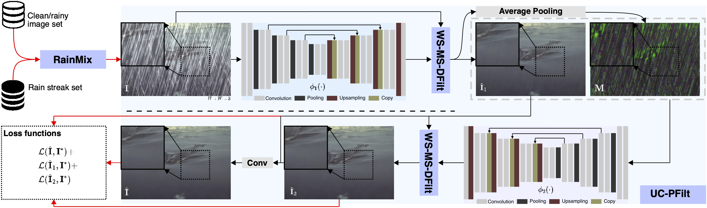
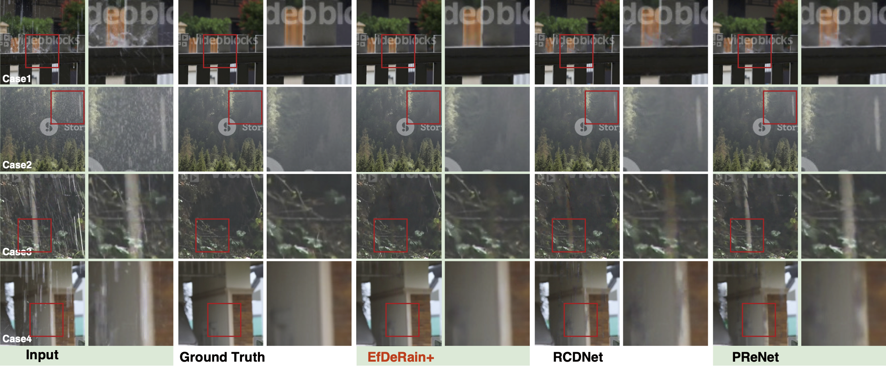

# EfficientDerain+
We further extend the efficientderain in https://github.com/tsingqguo/efficientderain via a novel predictive filtering framework. More details could be found in our pre-print version: https://arxiv.org/abs/2201.02366. 



## Requirements

- python 3.6
- pytorch 1.6.0
- opencv-python 4.4.0.44
- scikit-image 0.17.2
- torchvision 0.9.1
- pytorch-msssim 0.2.1

## Datasets
- Rain100L-old_version: https://github.com/nnUyi/DerainZoo/blob/master/DerainDatasets.md
- Rain100H-old_version: https://github.com/nnUyi/DerainZoo/blob/master/DerainDatasets.md
- Rain1400: https://xueyangfu.github.io/projects/cvpr2017.html
- SPA: https://stevewongv.github.io/derain-project.html
- Raindrop: https://paperswithcode.com/dataset/raindrop
- NTURain dataset: https://github.com/hotndy/SPAC-SupplementaryMaterials
 
## Pretrained models
Here is the urls of pretrained models included models : 

direct download: 
Coming soon.

google drive:
Coming soon.

baiduyun:
Coming soon.

## Train

- The code shown corresponds to version **v3**, for **v4** change the value of argument "**rainaug**" in file "**./train_*.sh**" to the "**true**" (train_*.sh means it's the training script of dataset *) 
- Unzip the "Streaks_Garg06.zip" in the "./rainmix"
- Change the value of argument "**baseroot**" in file "**./train.sh**" to **the path of training data**
- Edit the function "**get_files**" in file "**./utils**" according to the format of the training data
- Execute

```
sh train.sh
```

## Test

- The code shown corresponds to version **v3**
- Change the value of argument "**load_name**" in file "**./test.sh**" to **the path of pretained model**
- Change the value of argument "**baseroot**" in file "**./test.sh**" to **the path of testing data**
- Edit the function "**get_files**" in file "**./utils**" according to the format of the testing data
- Execute

```
sh test.sh
```

## Results

The specific results can be found in “**./results/data/DERAIN.xlsx**”




## Bibtex

```
@article{guo2024learning,
  title={Learning Uncertainty-Aware Filtering via RainMix Augmentation for High-Efficiency Deraining},
  author={Guo, Qing and Qi, Hua and Sun, Jingyang and Juefei-Xu, Felix and Ma, Lei and Lin, Di and Feng, Wei and Wang, Song
},
  journal={International journal of computer vision},
  year={2024}
}
```

